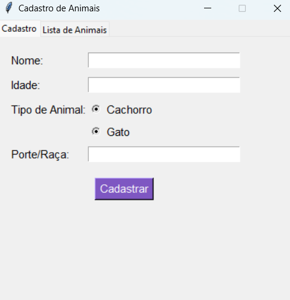
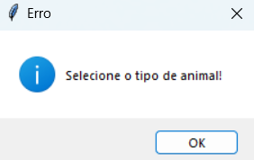

# Cadastro de Animais

## Objetivo

Este código foi criado para cadastrar e exibir animais, com informações sobre nome, idade, tipo (Cachorro ou Gato) e características específicas (Porte ou Raça). O programa é dividido em duas abas: **Cadastro** e **Lista de Animais**, e utiliza a biblioteca **Tkinter** para criar uma interface gráfica simples e intuitiva. O usuário pode cadastrar animais e visualizar a lista de forma organizada.

--------------------------------------------
## Capturas de Tela

### 1. Tela de Cadastro de Animal

### 2. Tela de Cadastro Preenchida

### 3. Lista de Animais

### 4. Mensagem de Sucesso - Cachorro

### 5. Mensagem de Sucesso - Gato

### 6. Mensagem de Erro 1

### 7. Mensagem de Erro 2

### 8. Mensagem de Erro 3

--------------------------------------------

## Estrutura e Funcionamento do Código

## 1. Classes Abstratas e Concretas

- **Classe Animal (Abstrata)**

A classe `Animal` é a base para os outros tipos de animais. Ela contém atributos comuns, como nome e idade, e define métodos para acessar e modificar esses atributos. O método **mostrar()** é abstrato, ou seja, cada classe filha (Cachorro e Gato) deve implementar esse método para exibir as informações dos respectivos animais de maneira personalizada.

- **Classe Cachorro (Concreta)**

  - A classe `Cachorro` herda de `Animal` e adiciona o atributo **porte**. O método **mostrar()** exibe as informações do cachorro, incluindo o porte.

- **Classe Gato (Concreta)**

  - A classe `Gato` também herda de `Animal` e adiciona o atributo **raça**. O método **mostrar()** exibe as informações do gato, incluindo a raça.

## 2. Função Principal

A função principal do código gerencia o fluxo do aplicativo, lidando com o cadastro dos animais e a exibição da lista.

  - a. **Função de Cadastro (cadastrar_animal)**

    - Quando o usuário preenche os campos de nome, idade e detalhe (que pode ser **porte** ou **raça**, dependendo do tipo de animal) e clica no botão **Cadastrar**, a função valida os dados fornecidos. Se estiver tudo correto, um objeto correspondente (Cachorro ou Gato) é criado e adicionado à lista de animais. A lista é então atualizada para refletir o novo cadastro.

  - b. **Função de Atualização (atualizar_lista)**

    - Essa função é responsável por atualizar a lista de animais na interface. Ela limpa a área de exibição e insere novamente as informações dos animais cadastrados, organizando-as de maneira estruturada.

  - c. **Função de Limpeza (limpar_campos)**

    - Após o cadastro de um animal, os campos de nome, idade e detalhe são limpos para permitir que o usuário cadastre outro animal sem precisar apagar os dados manualmente.

## 3. Interface Gráfica (Tkinter)

A interface é dividida em duas abas usando o widget **Notebook** do Tkinter:

- **Aba de Cadastro**: Contém os campos de texto para inserir o nome, idade e porte/raça. Há também **Radiobuttons** para selecionar o tipo de animal (Cachorro ou Gato) e um botão **Cadastrar** que chama a função para salvar os dados.
- **Aba de Lista de Animais**: Exibe a lista de animais cadastrados, mostrando as informações de cada um em formato organizado, como Nome, Tipo, Idade e Porte/Raça.

A lista é automaticamente atualizada sempre que um novo animal é cadastrado.

## 4. Widgets e Estilo

- **Label** e **Entry** são usados para capturar as informações inseridas pelo usuário.
- **Radiobuttons** são utilizados para selecionar o tipo de animal (Cachorro ou Gato).
- **Button** aciona as funções para cadastrar o animal e atualizar a lista.
- **Text** exibe a lista de animais cadastrados de forma clara e estruturada.
- A interface utiliza cores como **roxo** e **cinza claro**, proporcionando um design simples e agradável.

## 5. Comportamento do Aplicativo

Quando o usuário preenche o formulário e clica em **Cadastrar**, o animal é adicionado à lista e suas informações são exibidas na aba **Lista de Animais**. A interface permite também atualizar a lista de forma automática. Caso algum campo não seja preenchido corretamente, uma mensagem de erro será exibida para o usuário.

## 6. Persistência de Dados

Este código não possui persistência de dados. Ou seja, ao fechar o programa, todos os dados cadastrados são perdidos, e ao reiniciar a aplicação, a lista de animais estará vazia.

## Resumo

Este código implementa um sistema simples de cadastro de animais usando a biblioteca **Tkinter** em Python. Ele permite que o usuário cadastre informações sobre cachorros e gatos e visualize esses dados em uma lista. As informações são exibidas de forma estruturada e a lista é atualizada conforme novos animais são cadastrados. O programa não mantém os dados após o fechamento da aplicação.

